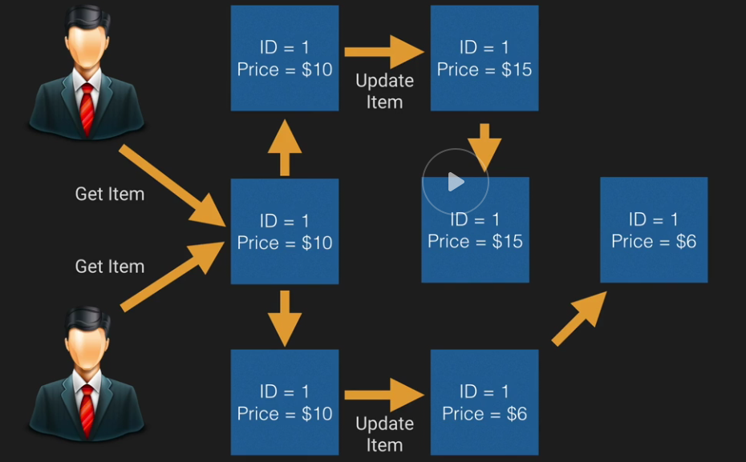
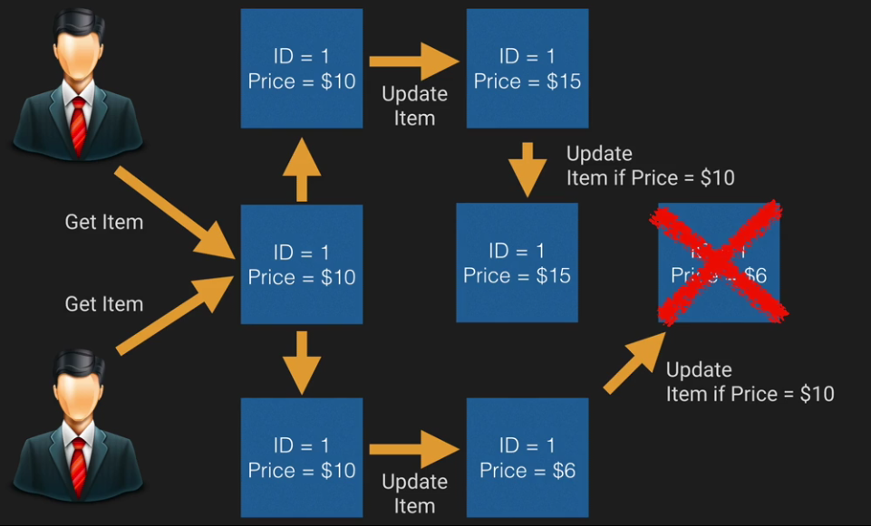

# DynamoDB

- SSD
- spread across 3 geographically distinct data centers

## Data consistency

### Eventual consistent reads (default)

Best read performance

### Strongly consistent reads

Always consistent

## Basics

- tables
    - items (like a row of data)
        - attributes (like a column of a data)

Nesting up to 35 level

## Capacity

Provisioned throughput capacity:
* write throughput $0.0065/h for every **10** units
* read throughput $0.0065/h for every **50** units
* 25 read/writes capacity units for free tier

Storage:
* First 25 Gb stored per month is free
* $0.25 Gb/month

```
Example:
capacity unit = 1 operation per second

1M writes/day -> 1M/(24h*60m*60s) = 11.6 rps = 12 write units = (0.0065/10)*12*24 = $0.1872 per day
1M reads/day -> 11.6 rps = 12 read units = (0.0065/50)*12*24 = $0,03744 per day

28 Gb = (25) + 3*0.25 = $0.75 per month

30 days * (0.1872 + 0,0374) + 0.75 = $7,488/month
```

## Provisioned throughput

* read provisioned throughput
    * all reads are rounded up increments to 4Kb
    * eventually consistent reads - 2 reads per second
    * storgly consistent reads - 1 read per second
* write
    * all writes are 1Kb
    * all writes consist of 1 write per second

example
```
to 10 items of 1kb per second using eventual consistency. What should you set the read throughput to?

1kb -> round to 4
4 Kb / 4Kb = 1 read unit per item

1x10 = 10 items
10/2 = 5 for eventual consistency
10 units for strong

10 x 6 kb per second eventual consistency

(( 8 / 4 ) * 10 )/ 2= 10 units for eventual

5 x 10 Kb per second eventual

(( 12 / 4 ) * 5 ) / 2 = 8 units for eventual

for writing:

5 items with each 10 kb data
5 x 10kb = 50 write units

```

When limit exceeded
`400 HTTP status code - ProvisionedThroughputExceededException`

limit exceeded for a table or for one or more global secondary indexes

## Indexes

### Primary keys

#### Single attribute (unique ID)

Partition key/Hash key

- one attribute
- no two items can have the same partition key value

input to an internal hash function. Function output determines the partition (physical location)

#### Composite

Partition key && Sort Key (Hash & Range) composed of two attributes

- two items can have the same partition key, but they must have a different sort key
- all items with the same partition key are stored together, in sorted order by sort key value

----

#### Local secondary index

* the same partition key, different sort key
* can only be created during table creation. They cannot be removed or modified later

#### Global secondary index

* has different partition key and different sort key
* can be added during table creation or added later

## Streams

streams stored for 24 hours (max)
stream can trigger lambda functions

Used to capture any kind of modification of the DynamoDB table:
* new item added
* item updating
* item removal

## Query vs Scan

### Query

query - by using only primary key attribute values, you must provide a partition attribute name and distinct value to search for

yuo can optionally provide a sort key attribute name and value, nand use a comparison operator to refine the search results.

by default query returns all attirubets. You can use `ProjectionExpression` param to return only some of the attributes.

Results are always sorted by the sort key. Sort order is ascending. To reverse the order, set the `ScanIndexForward` parameter to false

by default is eventually consistent but can be changed to be strongly consistent

### Scan

scan examines every item in the table.

## Web identity providers

1. web identity token (from identity provider)
2. App ID of provider
3. ARN of role

AssumeRoleWithWebIdentity Request -> AWS STS -> accesskeyid, secretaccesskey, sessiontoke, expiration (1 hour default), subjectfromwebidentity token (unique ID that appears in an IAM policy variable)

## conditional writes

update курильщика:

update здорового dynamodb:


if item = $10 then update to $12

cond. writes are idempotent

## Atomic counters

`UpdateItem`, atomic counter updates are not idempotent.

## Batch operations

`BatchGetItem` API (multiple tables, up 1 Mb of data, max 100 items)

