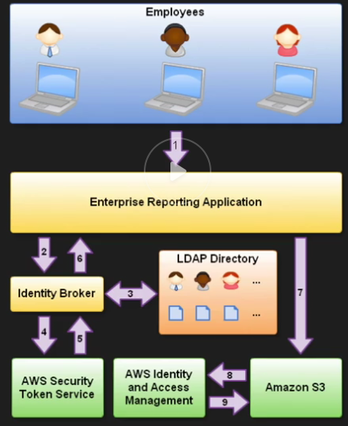

## Security Token Service

Grants users limited and temp access to AWS

Users from three sources:
* Federation
    * SAML
    * Temp access based off the users AD credentials
    * SSO
* Mobile apps
    * Facebook/Amazon/Google/OpenID
* Cross account access

### Terms

- Federation
    * joining list of users in one domain with a list of users in another domain
- Identity Broker
    * a service that allows you to take an identity from point A and join it to point B
- Identity Store
    *  AD, Facebook, Google
- Identities
    * users

#### Scenario 1

* Develop an Identity Broker to communicate with LDAP and STS
* Identity broker -> LDAP -> AWS STS
* Credentials -> App -> Access to resources

#### Scenario 2

* Develop an Identity Broker to communicate with LDAP and STS
* Identity broker -> LDAP -> IAM role for user
* Credentials -> App auth to STS -> Assume role -> Access to resources
